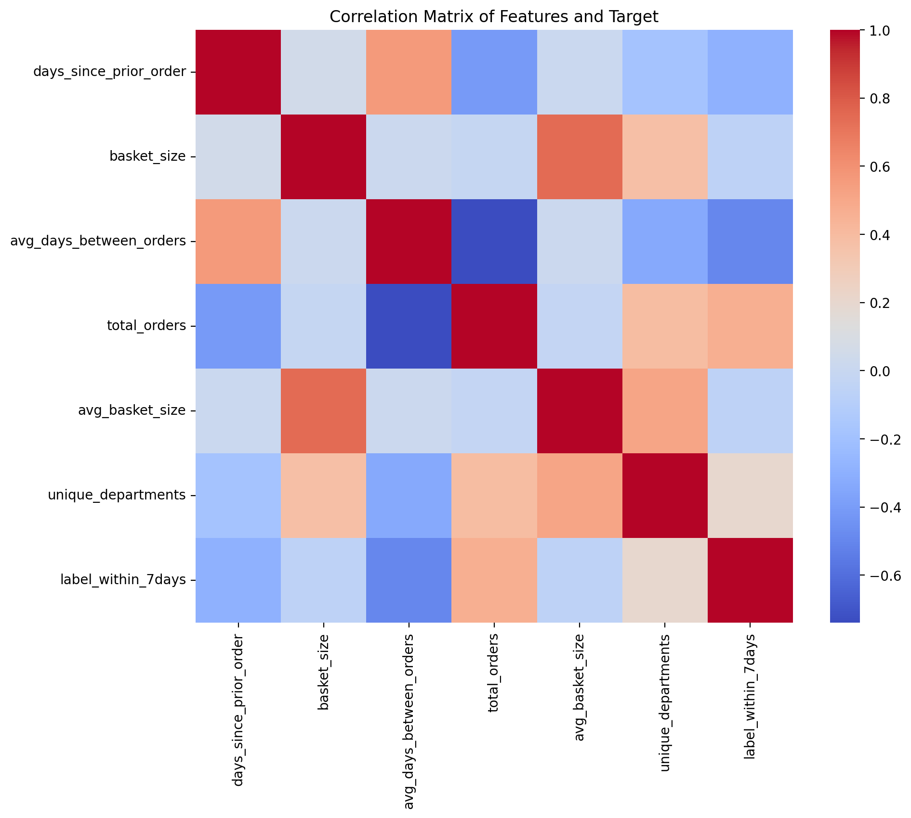
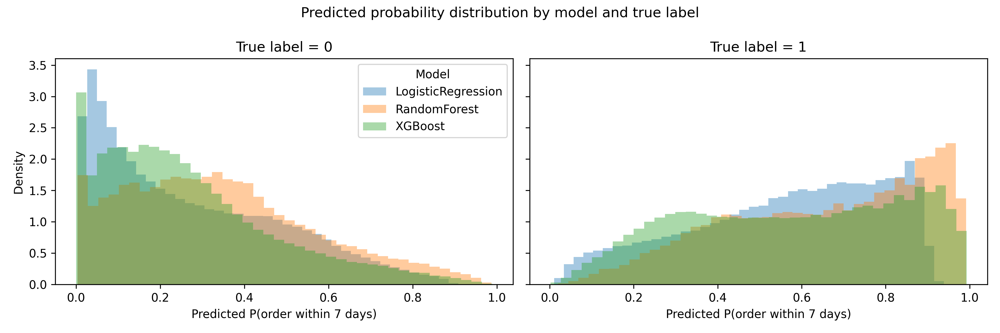
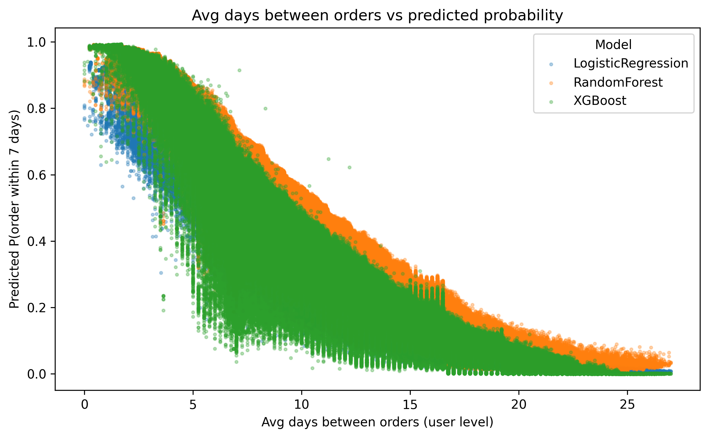

# e-commerce-order-prediction-user-analytics
The goal of this project is to build a machine learning model that predicts whether a user will place a new order within 7 days of their most recent purchase. This task addresses short-term user retention and helps identify high-risk churn users.

**YouTube Presentation Link:** https://youtu.be/uYlX4870tFc
## How to Use
1. Clone this repository and `cd` into it
2. Download the Instacart Market Basket Analysis CSV files from Kaggle and place them in the data/ folder
3. create a Python 3.9 environment, then install dependencies 
`make install`
4. Run the EDA notebook on the Instacart data
`make eda`
5. Train the model, test the data pipeline, and generate predictive visualizations.
`make all`
including `baseline rf xgb test prediction_plots`

## Dataset
Instacart Market Basket Analysis (Kaggle)
https://www.kaggle.com/datasets/yasserh/instacart-online-grocery-basket-analysis-dataset/data
Download the public CSV files from Kaggle and store them in a version-controlled GitHub repository.

Data cleaning: handle missing values (e.g., days_since_prior_order for the first order), merge product metadata, ensure chronological ordering of user histories.
### Tables used
orders.csv – order metadata (user ID, order sequence, day-of-week, hour-of-day, days-since-prior-order)

order_products__prior.csv & order_products__train.csv – product IDs and quantities for each order

products.csv, aisles.csv, departments.csv – product and category details

## 1. Preliminary Visualizations
In `EDA_instacart.ipynb`
We performed exploratory analysis on the Instacart Online Grocery Dataset to understand user behavior patterns.

- **Basket size distribution** — Average ≈ **10 items**, with a heavy tail for bulk shoppers.
- **Order distribution by day of week** — Majority of orders occur on **weekends** (Sunday & Monday peaks).
- **Top departments purchased** — *Produce*, *Dairy & Eggs*, and *Snacks* dominate.
- **Days since prior order** — Right-skewed distribution; most users reorder within **0–10 days**, with a long-tail peak at 7 and 30.

## 2. Data Processing
For data processing, we started with files from the Instacart dataset — orders, order_products__prior, order_products__train, products, aisles, and departments.
We combined prior and train order tables to form a unified purchase history and filled missing values in days_since_prior_order with zeros, since the first order for each user naturally has no previous interval

Then, we merged product metadata (aisle and department) into the product table to get category-level information.
At the order level, we computed basket size (number of products per order) and appended it to each order record.

Next, we aggregated these into user-level features:

Average days between orders

Total number of orders per user

Average basket size

Number of unique departments purchased

Finally, we created a supervised label: for each order, label = 1 if the next order occurred within 7 days; otherwise 0.
This was implemented by shifting the order sequence within each user group to calculate the interval until the next purchase.

The final training table combines order-level and user-level features into a single dataframe ready for modeling.

### 2.1 Correlation and feature insights
In `train_baseline.py`

We computed a correlation matrix between features and the target label:

- **`avg_days_between_orders`** is strongly *negatively* correlated with `label_within_7days`: users who order more frequently are much more likely to place another order within 7 days.
- **`total_orders`** and **`unique_departments`** show positive correlation with the label: heavy, loyal users with richer category coverage are more likely to reorder soon.
- **`basket_size`** and **`avg_basket_size`** have moderate positive correlation with the label, suggesting that larger baskets are associated with more engaged customers.

These patterns are consistent with intuition and confirm that the engineered behavioral features capture meaningful signals about short-term retention.

## 3. Modeling Method

Our modeling pipeline currently includes three supervised models:

- Logistic Regression (baseline)
- Random Forest
- XGBoost

All models share the same feature set and train/test split so that their performance can be compared fairly.

### 3.1 Feature set and target

The final modeling table combines order-level and user-level information into a single matrix `X` and a binary target `y`:

- **Order-level features**
  - `days_since_prior_order` – number of days since the previous order.
  - `basket_size` – number of items in the current order.

- **User-level features**
  - `avg_days_between_orders` – average ordering interval per user.
  - `total_orders` – total number of orders a user has placed.
  - `avg_basket_size` – average basket size across a user’s history.
  - `unique_departments` – number of distinct departments a user has purchased from.

- **Target label**
  - `label_within7days` / `y_true` – binary indicator: 1 if the next order occurs within 7 days of the current order, 0 otherwise.
  - Orders without a next order (last order per user) are dropped from training.

We use an 80/20 stratified train–test split so that the positive/negative class ratio is preserved in both sets.

### 3.2 Logistic Regression baseline

The baseline model is implemented in `src/train_baseline.py` using `sklearn.linear_model.LogisticRegression(max_iter=1000)`.

- The model is trained on the full feature set described above.
- On the test set, we compute:
  - `y_prob`: predicted probability of placing a new order within 7 days.
  - `y_pred`: hard class prediction using a 0.5 probability threshold.

We evaluate the baseline with multiple metrics:

- ROC-AUC and Average Precision (PR-AUC) to capture ranking quality and handle class imbalance.
- Accuracy, Precision, Recall, and F1-score via `classification_report`.
- A correlation matrix between features and the target, as well as confusion-matrix plots, are generated using `matplotlib` to better understand model behavior.

The test predictions (including `user_id`, `order_id`, features, `y_true`, `y_pred`, `y_prob`) are saved to:

- `data/predictions_logreg_lr.csv`

These prediction tables are later used for additional analysis and visualization (e.g., probability distributions and feature–score relationships).

### 3.3 Random Forest model

The Random Forest model is implemented in `src/train_rf.py`. We use a `RandomForestClassifier` with `500` trees and a maximum depth of `12`, requiring at least 20 samples per leaf and 50 per split, and using `max_features="sqrt"` and `class_weight="balanced"` to handle class imbalance. This configuration gives a good trade-off between performance and training time while preventing individual trees from overfitting.

- The model can capture non-linear interactions between user behavior features that are not modeled by Logistic Regression.

Evaluation uses the same metric set as the baseline:

- ROC-AUC, PR-AUC
- Accuracy, Precision, Recall, F1-score
- Confusion matrix and feature importances (from the tree ensemble) are plotted to inspect which features drive predictions.

Test-set predictions are stored as:

- `data/predictions_logreg_rf.csv`

### 3.4 XGBoost model

The XGBoost model is implemented in `src/train_xgb.py` using `xgboost.XGBClassifier`.

- It is trained on the same feature matrix and target as the other models.
- Gradient-boosted trees are used to model complex, non-linear relationships and interactions between features.

The XGBoost predictions are saved to:

- `data/predictions_logreg_xgb.csv`

These outputs enable side-by-side comparison with the baseline and Random Forest in downstream visualizations.

## 4. Results and Visualization

Our model that can meaningfully predict whether a user will place a new order within 7 days of their current purchase. All three models (Logistic Regression, Random Forest, XGBoost) achieve strong ranking performance on the held-out test set, with ROC-AUC values above 0.81 and PR-AUC values around 0.75–0.76.

### 4.2 Overall model performance

- **Logistic Regression**

  - ROC-AUC: **0.815**
  - PR-AUC (Average Precision): **0.745**
  - Accuracy: **0.75**
  - Precision (class 1): **0.69**, Recall (class 1): **0.64**, F1-score: **0.66** :contentReference[oaicite:0]{index=0}  

- **Random Forest**

  - ROC-AUC: **0.8233**
  - PR-AUC (Average Precision): **0.7595**
  - Accuracy: **0.75**
  - Precision (class 1): **0.66**, Recall (class 1): **0.71**, F1-score: **0.69** :contentReference[oaicite:1]{index=1}  

- **XGBoost**

  - ROC-AUC: **0.8240**
  - PR-AUC (Average Precision): **0.7603**
  - Accuracy: **0.76**
  - Precision (class 1): **0.73**, Recall (class 1): **0.60**, F1-score: **0.66** :contentReference[oaicite:2]{index=2}  

These results show that even the baseline logistic regression already separates short-term reorders from non-reorders reasonably well, and the tree-based models (Random Forest and XGBoost) provide small but consistent improvements in ROC-AUC and PR-AUC.

### 4.3 Confusion matrix (XGBoost)

The XGBoost confusion matrix on the test set is:

- **True negatives (0 → 0):** 351,769 correctly predicted “no order within 7 days”
- **False positives (0 → 1):** 57,563 orders incorrectly flagged as short-term reorders
- **False negatives (1 → 0):** ≈100k missed short-term reorders
- **True positives (1 → 1):** 155,711 correctly identified short-term reorders

This corresponds to relatively high precision for the positive class (many predicted “1” are real reorders), at the cost of missing some true positives (recall ≈ 0.60). Depending on the business goal (e.g., conservative targeting of coupons vs. aggressive recall), the decision threshold can be adjusted.

### 4.4 Visualizing model predictions
**Predicted probability distribution by model and true label**

This plot shows the distribution of predicted probabilities (P(order within 7 days)) for the three models (Logistic Regression, Random Forest, XGBoost), split by the true label:

- The **left panel** contains orders with `y_true = 0` (no order within 7 days).  
  All three models place most probability mass close to 0, especially
  the tree-based models.
- The **right panel** contains orders with `y_true = 1`
  (order within 7 days).  
  Here the distributions shift towards 1, with many cases getting high
  predicted probabilities.

Positive and negative examples are clearly separated in probability space, and Random Forest / XGBoost produce more extreme (probability near 0 or 1) predictions than Logistic Regression, which is more conservative.

**Avg days between orders vs predicted probability**

This scatter plot relates a key behavioral feature to the model outputs: the x-axis is **average days between orders per user**, and the y-axis is
the predicted probability of placing a new order within 7 days. Points are colored by model:

- Users with **short average intervals** (left side of the plot) receive
  **high predicted probabilities**, especially under Random Forest
  and XGBoost.
- As the average days between orders increases, the predicted probability
  drops smoothly towards 0 for all models.
- The tree-based models capture a more non-linear, sharper decline,
  while Logistic Regression shows a smoother slope.

This figure confirms that all models have learned a sensible pattern: frequent shoppers are much more likely to place a short-term reorder, and the non-linear models sharpen this relationship.

Overall, the models:

- Achieve **>0.81 ROC-AUC** and **≈0.75–0.76 PR-AUC** on the held-out test set.
- Provide interpretable relationships between user behavior (order frequency, basket size, category diversity) and short-term reorder probability.
- Produce confusion matrices and correlation patterns that align with real-world expectations about loyal vs. infrequent shoppers.

Therefore, we consider the current system to have successfully met the project goal of predicting whether a user will place a new order within 7 days and of identifying key retention drivers in e-commerce ordering behavior.
